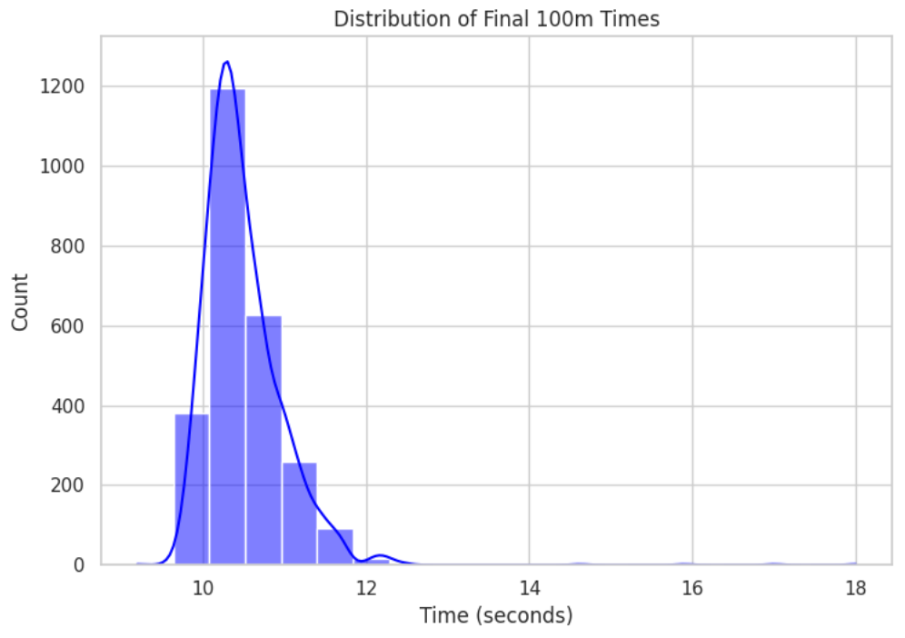

# SprintTimePredictor
# Abstract

Sprinting is a well-oiled mixture of reaction time, acceleration, max velocity, and speed maintenance through the finish line. While final times are commonly used to judge performance, the race metrics before are just as valuable in the information that they provide of how the athlete did it. This research investigates the question: How accurately can machine learning models predict sprint performance using race progression data across the 100m, 200m, and 400m events? In order to answer this question, publicly available race records were preprocessed to create three datasets containing reaction time, wind, and time and velocity splits for the 100m, 200m, and 400m races. Four supervised regression models—Linear Regression, Random Forest Regression, Gradient Boosting Regression, and HistGradientBoosting Regression—were trained on the data to be able to predict final times from early and intermediate race measurements. The datasets contained 2,631 samples for the 100m event, 2,345 samples for the 200m event, and 2,884 samples for the 400m event. Model performances were evaluated using Mean Squared Error (MSE), Root Mean Squared Error (RMSE), and R² score. HistGradientBoosting Regression earned the best results for the 100m, Gradient Boosting Regression rose to the top for the 200m, and Random Forest Regression finished \#1 in accuracy for the 400m. All these results explain how machine learning can use race progression data for prediction models, and that the ideal model varies based on the characteristics of the sprint event being analyzed.

# Intro

**Intro**  
Sprinting events in track and field like the 100-meter, 200-meter, and 400-meter races all need athletes to push themselves in terms of acceleration, reach maximum velocity, and hold that top speed through the finish line. Fractions of a second can make all the difference. Performance has been traditionally judged by the final times of an athlete in each of the races. Although, that final time tells us nothing on how an athlete achieved success or failure, losing the knowledge of which parts of the race were most influential to their performance.   
Race progression data, such as the time and velocity splits of an athlete through a race in its entirety, gives a fuller picture on how an athlete did. For example, an athlete in the 100m who attains max velocity faster has a different profile to the sprinting of an athlete whose acceleration is more progressive but can maintain speed more efficiently. Yet, their ending times being the same make the athletes seem identical. Understanding their differences can help both sprinters and their coaches find flaws in their performance and develop more productive training regiments.   
This project investigates the research question:  
How accurately can machine learning models predict sprint performance using race progression data across the 100m, 200m, and 400m events?  
The end goal of this research project is to create predictive models capable of accurately estimating final sprint times based on early and intermediate metrics. By analyzing which features impact performance the most, this research also intends to show how the phases of a race influence its final performance.  
This project is set up as a supervised machine learning regression task. The input data are the velocity and time splits for each race: every 10m for the 100m and every 50m for the 200m and 400m. The output from each model is a continuous numerical value: the athlete’s final race time. Four regression algorithms were used to establish which was most effective in predicting final sprint performance.   
This research is personally meaningful to me as I run all three events for Saratoga High School. In my own races, I am often behind everyone else in the first half, and only gain ground and reach a podium spot in the second half. Through my own experiences, I grew interested in understanding acceleration and race progression. By combining machine learning with the sprint data of the world’s best athletes, this project is the union of my inquisitiveness in the sport of track and field with data science while diving deep into methods of athletic analysis. 

# Background

**Background**  
	Previous research has shown that the different phases in a race aren’t all equal in their contributions to the final time. Rather, it varies between events. The 100-meter dash is heavily dependent on an athlete’s explosiveness out of the blocks and ability to hit max velocity as soon as possible, whereas the 200-meter and 400-meter rely more on athletes maximizing speed over a longer distance while fighting the fatigue.  
	Tønnessen, Haugen, and Shalfawi (2013) examined the reaction time of the top athletes at the World Championships and found that it was associated with overall performance in sprinting events. Their study analyzed over 1300 elite performances and confirmed that small reaction time differences in the start phase of races influenced final times. Even though their work mainly focused on reaction time, it speaks to the value that evaluating early-race metrics has in predicting ending performances.  
	Maćkała, Fostiak, and Kowalski (2015) investigated determinants of acceleration in the 100m dash and specified the bonds between acceleration, stride form, and the final times that they led to. Their results show that the early phase of sprinting events has an impact on a sprinter’s overall performance.  
	In more recent times, machine learning was implemented to the prediction of sprints. Tam and Yao (2024) used these methods to predict 100m times with velocity curve information. Their findings established the fact that models can depict the complex connections between the increase in a sprinter's velocity to their ending time. Unlike normal paths to reach the same goal, machine learning can recognize nonlinear patterns in the data that aren’t as obvious when using simple correlations.  
	Even though previous studies have delved into race metrics like reaction time, velocity, and biomechanics, this research broadens upon all others by applying it to all springing events. As opposed to solely relying on the 100m, this project goes into the 100m, 200m and 400m races to determine how the factors between each event affect the predictions of their final times.

# Dataset

**Dataset**  
	For sprint performance prediction data, three datasets consisting of the 100m, 200m, and 400m were used. The data contains measurements that play a big role in all the races, made up of the wind at that time, the reaction time, and the time split with velocity at specific distances corresponding to which event is being analyzed. The intent with using the holistic data instead of only final times is to allow the machine learning models to see how the athlete developed, maintained, and controlled their speed from start to finish.  
	The initial dataset used was from a publicly available GitHub repository housing sprint data ready for machine learning use. This dataset was first selected as it had the necessary race variables in an organized manner for the models to use as inputs. In order to increase the amount of data and the variety of sprinters employed, the data was expanded to the elite race logs of AthleteFirst.  
	Because AthleteFirst’s publicly available race databases store information in a PDF format rather than in a CSV, preprocessing was required before it could be applied to the models. The race records were first extracted from the PDFs using MinerU, transforming them into markdown files. The markdown files were then processed using Python code generated with Gemini assistance to convert the obtained data into usable CSV files fit for machine learning.  
	The final datasets comprised of:

| Event | \# of Samples | \# of Features | Feature Type |
| :---- | :---- | :---- | :---- |
| 100 Meter | 2631 | 26 | Wind speed, reaction time, 10-meter split times and velocity measurements |
| 200 Meter | 2345 | 15 | Wind speed, reaction time, 50-meter split times and velocity measurements |
| 400 Meter | 2884 | 22 | Wind speed, reaction time, 50-meter split times and velocity measurements |

	The 100M dataset included measurements at 10m intervals. This was done to display the acceleration and max velocity of an athlete during the race. For the 200m and 400m, datasets included measurements at 50m intervals, differing from the 100m in that the models studied the acceleration and speed maintenance needed for the longer races.   
	The target output was the athlete’s ending times. Therefore, the models used the race information as input features to identify the relationship between starting and intermediate splits against final performance, then attempting to predict it itself.  
	The datasets were divided into training and testing subsets with a random\_state \= 42 for precise results every time. The exact training and testing split is 80% and 20%. 

# 100M

  
![][image2]  
![][image3]  
![][image4]

# 200M

![][image5]  
![][image6]  
![][image7]  
![][image8]

# 400M

![][image9]  
![][image10]  
![][image11]

# Methodology / Models

**Methodology / Models**  
	This research used supervised machine learning for predicting final times from the race progression datasets. Because the output is a measurement, not a category, regression models were used. Four different models were applied and contrasted: Linear Regression, Random Forest Regression, Gradient Boosting Regression, and HistGradientBoosting Regression.  
	Linear Regression was used as a baseline model since it's a simple method for measuring the relationship between race split input values and final time output values. The model assumes that the association between these 2 variables can be portrayed through the linear equation:   
y=β0​\+β1​x1​+β2​x2​\+...+βn​xn  
Where y is the race time predicted by the model, x is the split times and velocities given to the model, and β is the model’s learned coefficients. Even though sprinting is much more than a linear relationship, as it is more often affected by non-linear factors, using a Linear Regression gives a useful benchmark for seeing how much farther more complex models reach.  
	Random Forest Regression was chosen to represent the more complex factors that sprint progression entails. Random Forest takes in predictions from multiple decision trees to put forth a more powerful mode. Each decision tree learns a different relationship between the inputs and output. By averaging the predictions from all of them, Random Forest can therefore decrease overfitting and increase the stability and accuracy of predictions. This kind of model is specifically useful for predicting sprint times because different race phases have a different effect on the final time. For example, a small increase in a sprinter’s acceleration in the beginning of the race can have a profound impact on their final time.      
	Gradient Boosting Regression was utilized to improve the overall accuracy of predicted times by creating many weaker models in a sequential fashion, building the next one off of the last. By doing this, each new model focuses on righting the wrongs of its predecessor, unlike Random Forest which assembles trees autonomously and separated from each other. This method allows the model to discern more obscure bonds between the progression and the end.  
	HistGradientBoosting Regression was designated for its efficiency in handling larger datasets. Rather than analyzing every single feature in the data, the model puts variables into groups known as bins, improving efficiency by shortening the amount needed to be investigated. The model was predicted to perform well as it does well when being used alongside nonlinear relationships. For example, a small increase in a sprinter’s acceleration in the beginning of the race can have a profound impact on their final time. For example, an athlete’s early acceleration to top speed may sway how well they can hold onto that max velocity.  
	Each model was independently trained on the 100m, 200m and 400m datasets. The preprocessing steps were applied to all 3 tests for a fair distinction.

The general workflow was:

1. Load and preprocess the sprint progression datasets.  
2. Separate race progression features from the final times.  
3. Split the data into 80% training and 20% testing subsets.  
4. Train each regression model using the training data.  
5. Generate predictions on unseen testing data.  
6. Compare model performance using the evaluation metrics.

All models had a random\_state \= 42 so that the results could be reproduced if needed.

The performance of the models were judged based on these three metrics:

Mean Squared Error (MSE) is a measure of the average squared difference between the predicted and actual race times. A lower MSE value signifies smaller errors in prediction.

Root Mean Squared Error (RMSE) represents prediction error in the same units as the target variable, allowing a more clear divergence in the difference between sprint times.

The R² score measures how much variation in final race times can be explained by the model. A value closer to 1 means demonstrates a stronger predictive nature. 

   
   

# Results and Discussion

**Results and Discussion**  
The end goal of the research was to figure out how accurately machine learning models can predict sprint performance using race progression data across the 100m, 200m, and 400m events. Four regression models were assessed against 3 datasets, one for each sprinting event: Linear Regression, Random Forest Regression, Gradient Boosting Regression, and HistGradientBoosting Regression. The performances of the models were evaluated with Mean Squared Error (MSE), Root Mean Squared Error (RMSE), and R² score.   
	All in all, the results of the models substantiate the fact that machine learning models are able to predict final sprint times using prior sprint data. The strongest models had high R² scores, highlighting how velocity and time splits have the necessary information to foresee an athlete’s performance. However, no model outperformed the other approaches used. Instead, the best model varied based on the distance being investigated: HistGradientBoosting Regression attained the best results for the 100m event, Gradient Boosting Regressor was best for the 200m, and Random Forest Regressor had the peak outcomes for the 400m.  
The 100M dataset had the strongest predictive performance for all 3 of sprinting events. The model with the best performance was the HistGradientBoosting Regression model, with a MSE score of 0.0108, RMSE of 0.1040, and R² score of 0.9379.

| Model | MSE | RMSE | R²  |
| :---- | :---- | :---- | :---- |
| Linear Regression | 0.0530 | 0.2302 | 0.6958 |
| Random Forest Regression | 0.0157 | 0.1255 | 0.9096 |
| Gradient Boosting Regression | 0.0291 | 0.1706 | 0.8329 |
| HistGradientBoosting Regression | 0.0108 | 0.1040 | 0.9379 |

The HistGradientBoosting Regression coming out with the best performance shows how the 100m dash has complex nonlinear relationships between beginning acceleration, velocity progression, and final times. Because the 100m is a race heavily influenced by acceleration and velocity, the model’s capacity for noticing subtle patterns between close split times was a big part in its high accuracy.  
![][image12]  
![][image13]

The 200m data had a lower accuracy of prediction when compared to the 100m and 400m datasets. The model with the best performance was Gradient Boosting Regression, with a MSE score of 0.1738, RMSE of 0.4170, and R² score of 0.7946. 

| Model | MSE | RMSE | R²  |
| :---- | :---- | :---- | :---- |
| Linear Regression | 0.3018 | 0.5494 | 0.6435 |
| Random Forest Regression | 0.2325 | 0.4822 | 0.7253 |
| Gradient Boosting Regression | 0.1738 | 0.4170 | 0.7946 |
| HistGradientBoosting Regression | 0.2167 | 0.4655 | 0.7441 |

The Gradient Boosting Regression performing as the best model may be attributed to the mechanics of the race itself. Unlike the 100m, the 200m has the additional element of running the curve, along with a higher distance which introduces pacing strategies, fatigue management, and the higher need for maintaining form to keep max velocity. These factors possibly introduced additional variation that weren’t visible by simply using split times.   
![][image14]  
![][image15]  
The 400m dataset had a solid predictive performance, falling in the middle of the 100m and the 200m datasets. The model with the best performance was Gradient Boosting Regression, with a MSE score of 0.1738, RMSE of 0.4170, and R² score of 0.7946.

| Model | MSE | RMSE | R²  |
| :---- | :---- | :---- | :---- |
| Linear Regression | 1.6546 | 1.2863 | 0.4502 |
| Random Forest Regression | 0.2469 | 1.2863 | 0.9180 |
| Gradient Boosting Regression | 0.3027 | 0.5502 | 0.8994 |
| HistGradientBoosting Regression | 0.3091 | 0.5560 | 0.8973 |

 The Random Forest Regression ending as the best model illustrates the complex interactions of different race phases in the longer sprinting event, definitely pictured with decision-tree-based models. Because athletes have different pacing strategies for the 400m, Random Forests’s talent for analyzing various patterns across the data is attributed to its high prediction accuracy.  
![][image16]  
![][image17]

Across all 3 of the sprint distance events, the results exhibit how different machine learning models are more appropriate for different sprint predictions. HistGradientBoosting Regression was best for the 100m dash, where quick acceleration and high velocity are the name of the game. Gradient Boosting Regression produced the strongest results for the 200m, since athletes have to balance both max velocity and speed maintenance. Random Forest Regression ended as the best for the 400m event, due to its longer race introducing more muscle fatigue and different pacing strategies. All these findings propose the idea of how the distances themselves affect the sprint prediction problem. Shorter distance events do well with models that can exemplify the nonlinear relationships among acceleration and velocity, while longer distance events make the most on ensemble models suited for distinguishing wider patterns of performance. In lieu of having a universal model for all distances, future sprint analytics workers would reap better benefits from having distance-specific models refined for predicting exact times for those events.   

# Conclusion

**Conclusion**  
	This research project explored if machine learning models could accurately predict sprint performance using race progression data from the 100m, 200m, and 400m events. Four regression models were employed and compared to determine which was the best when it came to predicting final race times.  
	The results proved that machine learning models can apply both time and velocity splits to predicting final times. HistGradientBoosting Regression was number one for 100m times, with an R² score of 0.9379, Gradient Boosting Regression executed the best for 200m with an R² score of 0.7946, and Random Forest Regression was the peak for 400m with an R² score of 0.8973.  
These conclusions denote that different sprint distances have various effects on the models used for their predictions. The variations between races underline the significance of taking into account the structure of races and the performance they demand when constructing prediction models.  
Future improvements could include incorporating more variables such as biomechanical measurements when sprinters run, the or the sprinters height and weight. Broadening the scope of the models not only allows for better prediction but deepens their ability to be used for personalized training programs for every kind of athlete.   

# References

**References**  
Tam, C. K., & Yao, Z.-F. (2024). Advancing 100m Sprint Performance Prediction: A Machine Learning Approach to Velocity Curve Modeling and Performance Correlation. PLOS ONE.  
Tønnessen, E., Haugen, T., & Shalfawi, S. A. I. (2013). Reaction Time Aspects of Elite Sprinters in Athletic World Championships. Journal of Strength and Conditioning Research.  
Maćkała, K., Fostiak, M., & Kowalski, K. (2015). Selected Determinants of Acceleration in the 100m Sprint. Journal of Human Kinetics.  
AthleteFirst. Elite Sprint Performance Database.
